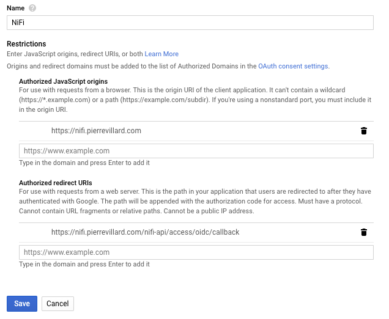
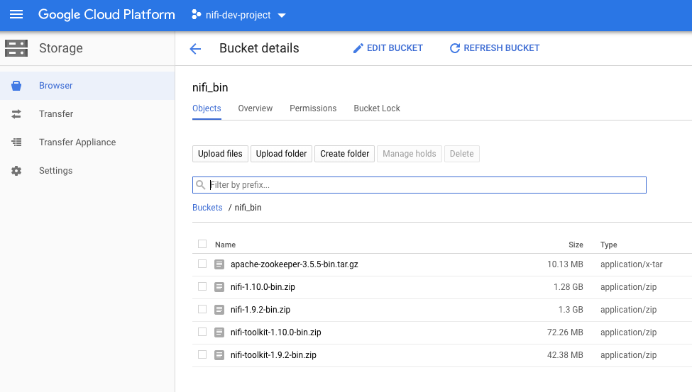
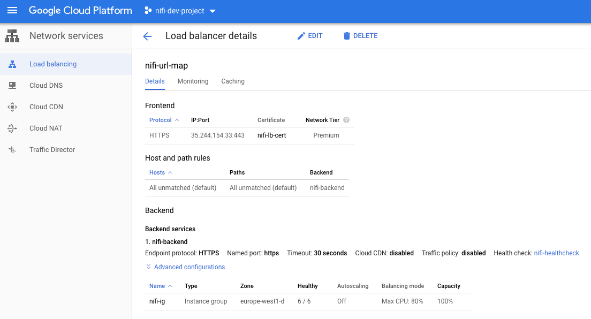

This story is a follow up of [this previous story](https://pierrevillard.com/2019/08/21/nifi-with-oidc-using-terraform-on-the-google-cloud-platform/) about deploying a single secured NiFi instance, configured with OIDC, using Terraform on the Google Cloud Platform. This time it’s about deploying a secured NiFi cluster.

In this story, we’ll use Terraform to quickly:

- **deploy a NiFi CA server** as a convenient way to generate TLS certificates
- **deploy an external ZooKeeper instance** to manage cluster coordination and state across the nodes
- **deploy X secured NiFi instances clustered together**
- **configure NiFi to use OpenID connect** for authentication
- **configure an HTTPS load balancer with Client IP affinity** in front of the NiFi cluster

_Note_ — I assume you have a domain that you own ([you can get one with Google](https://domains.google/)). It will be used to map a domain to the web interface exposed by the NiFi cluster. In this post, I use my own domain: pierrevillard.com and will map nifi.pierrevillard.com to my NiFi cluster.

_Disclaimer_ — the below steps should not be used for a production deployment, it can definitely get you started but I’m just using the below to start a secured cluster (there is no configuration that one would expect for a production setup such as a clustered Zookeeper, disks for repositories, etc).

**If you don’t want to read the story and want to get straight into the code,** [**it’s right here**](https://github.com/pvillard31/nifi-gcp-terraform/tree/master/gcp-cluster-secured-nifi-oidc)**!**

* * *

**What is Terraform?**

[Terraform](https://www.terraform.io/intro/index.html) is a tool for building, changing, and versioning infrastructure safely and efficiently. Terraform can manage existing and popular service providers as well as custom in-house solutions.

Configuration files describe to Terraform the components needed to run a single application or your entire datacenter. Terraform generates an execution plan describing what it will do to reach the desired state, and then executes it to build the described infrastructure. As the configuration changes, Terraform is able to determine what changed and create incremental execution plans which can be applied.

The infrastructure Terraform can manage includes low-level components such as compute instances, storage, and networking, as well as high-level components such as DNS entries, SaaS features, etc.

* * *

**What is NiFi?**

[Apache NiFi](https://nifi.apache.org/) is an easy to use, powerful, and reliable system to process and distribute data. Apache NiFi supports powerful and scalable directed graphs of data routing, transformation, and system mediation logic. In simpler words, Apache NiFi is a great tool to collect and move data around, process it, clean it and integrate it with other systems. As soon as you need to bring data in, you want to use Apache NiFi.

* * *

**Why ZooKeeper?**

<figure>

<figcaption>

Apache NiFi clustering

</figcaption>

</figure>

Best is to [refer to the documentation](https://nifi.apache.org/docs/nifi-docs/html/administration-guide.html#clustering), but, in short… NiFi employs a Zero-Master Clustering paradigm. Each node in the cluster performs the same tasks on the data, but each operates on a different set of data. One of the nodes is automatically elected (via Apache ZooKeeper) as the Cluster Coordinator. All nodes in the cluster will then send heartbeat/status information to this node, and this node is responsible for disconnecting nodes that do not report any heartbeat status for some amount of time. Additionally, when a new node elects to join the cluster, the new node must first connect to the currently-elected Cluster Coordinator in order to obtain the most up-to-date flow.

* * *

### OAuth Credentials

First step is to create the OAuth Credentials (at this moment, this cannot be done using Terraform).

- Go in your GCP project, APIs & Services, Credentials.
- Click on Create credentials, OAuth client ID. Select Web application.
- Give a name like “NiFi”. For Authorized JavaScript origins, use your own domain. I’m using: [https://nifi.pierrevillard.com](https://nifi.pierrevillard.com:8443./). For Authorized redirect URIs, I’m using: [https://nifi.pierrevillard.com/nifi-api/access/oidc/callback](https://nifi.pierrevillard.com:8443/nifi-api/access/oidc/callback). Please adapt with your own domain (note there is no port as we'll use the load balancer to access the cluster)
- Click Create

<figure>

<figcaption>

Create the OAuth credentials

</figcaption>

</figure>

Once the credentials are created, you will get a client ID and a client secret that you will need in the Terraform variables.

By creating the credentials, your domain will be automatically added to the list of the “Authorized domains” in the OAuth consent screen configuration. It protects you and your users by ensuring that OAuth authentication is only coming from authorized domains.

### Download the NiFi binaries in Google Cloud Storage

In your GCP project, create a bucket in Google Cloud Storage. We are going to use the bucket to store the Apache NiFi & ZooKeeper binaries (instead of downloading directly from the Apache repositories at each deployment), and also as a way to retrieve the certificates that we’ll use for the HTTPS load balancer.

_Note — you’ll need Apache ZooKeeper 3.5.5+._

You can download the binaries using the below links:

- [Apache NiFi](https://nifi.apache.org/download.html)
- [Apache ZooKeeper](https://zookeeper.apache.org/releases.html#download)

Here is what it looks like:

<figure>

<figcaption>

Content of the bucket in Google Cloud Storage

</figcaption>

</figure>

_Note — you’ll need to use the NiFi Toolkit version 1.9.2_

### Deploy NiFi with Terraform

Once you have completed the above prerequisites, installing your NiFi cluster will only take few minutes. Open your Google Cloud Console in your GCP project and run:

<figure>

https://gist.github.com/pvillard31/d5677834b07c2ca0872beb6964d218b6

<figcaption>

Deploy script

</figcaption>

</figure>

If you execute the above commands, you’ll be prompted for the below informations. However, if you don’t want to be prompted, you can directly update the _variables.tf_ file with your values to deploy everything.

Variables to update:

- **project** // GCP Project ID
- **nifi-admin** // Google mail address for the user that will be the initial admin in NiFi
- **san** // FQDN of the DNS mapping for that will be used to access NiFi. Example: nifi.example.com
- **proxyhost** // FQDN:port that will be used to access NiFi. Example: nifi.example.com:8443
- **ca\_token** // The token to use to prevent MITM between the NiFi CA client and the NiFi CA server (must be at least 16 bytes long)
- **oauth\_clientid** // OAuth Client ID
- **oauth\_secret** // OAuth Client secret
- **instance\_count** // Number of NiFi instances to create
- **nifi\_bucket** // Google Cloud Storage bucket containing the binaries

Here is what it looks like on my side (after updating the _variables.tf_ file):

<figure>

https://gist.github.com/pvillard31/e64b82e6443bed96318e5c174b5c1e5f

<figcaption>

Execution of the deploy script

</figcaption>

</figure>

### Explanations

The first step is to deploy the NiFi Toolkit on a single VM to run the CA server that is used to generate certificates for the nodes and the load balancer. Once the CA server is deployed, a certificate is generated for the load balancer and pushed to the Google Cloud Storage bucket.

The script you started is waiting until the load balancer certificate files are available on GCS. Once the files are available, files are retrieved locally to execute the remaining parts of the Terraform template. It will deploy the ZooKeeper instance as well as the NiFi instances and the load balancer in front of the cluster. All the configuration on the NiFi instances is done for you. Once the script execution is completed, certificates files are removed (locally and on GCS).

### After 5 minutes or so…

The load balancer has been created and you can retrieve the public IP of the load balancer:

<figure>

<figcaption>

Retrieve the external public IP of the HTTPS load balancer

</figcaption>

</figure>

You can now update the DNS records of your domain to add a DNS record of type A redirecting nifi.pierrevillard.com to the load balancer IP.

I can now access the NiFi cluster using [https://nifi.pierrevillard.com](https://nifi.pierrevillard.com) and authenticate on the cluster using the admin account email address I configured during the deployment.

Here is my 6-nodes secured NiFi cluster up and running:

<figure>

<figcaption>

6-nodes secured NiFi cluster

</figcaption>

</figure>

<figure>

<figcaption>

6 nodes with the elected primary and coordinator nodes

</figcaption>

</figure>

I can now update the authorizations and add additional users/groups.

_Note — you could use Google certificates instead of the ones generated with the CA server to remove the warnings about untrusted certificate authority._

### Cleaning

To destroy all the resources you created, you just need to run:

**terraform destroy -auto-approve**

As usual, thanks for reading, feel free to ask questions or comment this post.
